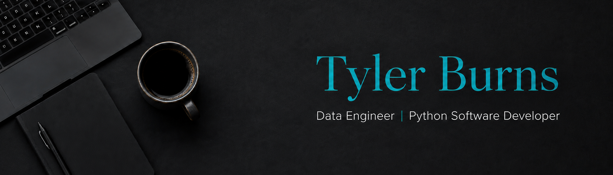

Hello, I'm Tyler. I'm a **Data Engineer and Python Software Developer** experienced in building production applications, data pipelines, analytics, and automation.

- Developing reliable data pipelines and integrations with Python, SQL, REST APIs, and Domo.
- Transforming and validating data using Polars, pandas, and SQL.
- Creating KPI models, dashboards, and decision-support tools.
- Building Python applications that solve complex operational problems.

## 🛠️ Tools

- **Languages:** Python, SQL, JavaScript, HTML/CSS
- **Data & Analytics:** Polars, pandas, SQL Server, Domo, Excel
- **Application Development:** Flet, React, Tailwind CSS, REST APIs
- **Automation & Testing:** Playwright, pytest

## 📚 Projects

See my [Portfolio](https://github.com/TABurns/Portfolio).
